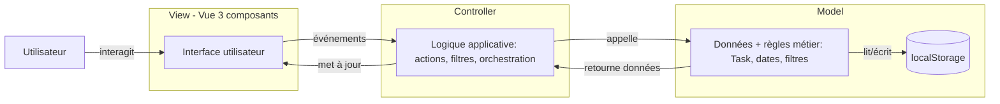
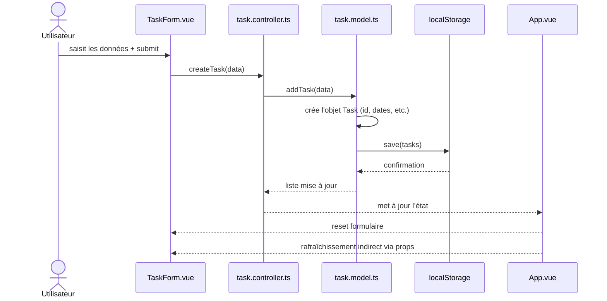
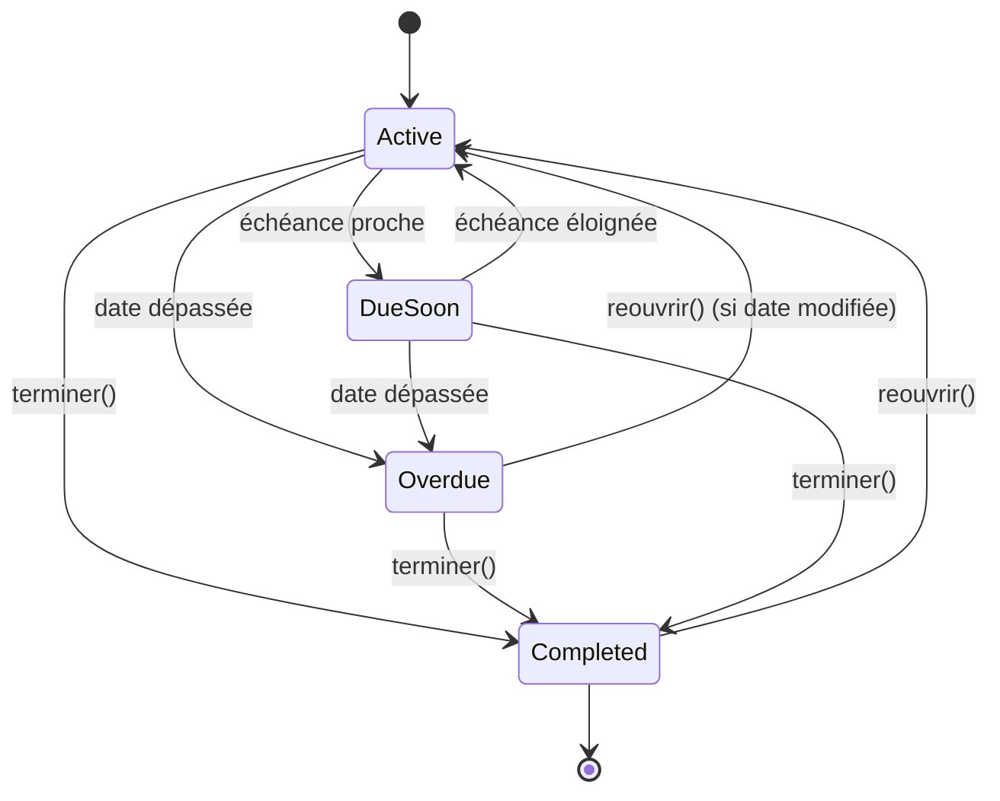

<div style="text-align:center;">
  
</div>

> Un projet simple en apparence, mais qui permet d’évaluer de nombreux aspects essentiels du développement frontend : typage, architecture, logique métier, gestion de données, et plus encore. L’objectif est de créer une application de gestion de tâches (To-Do List) en Vue 3 avec TypeScript, en respectant une architecture MVC, et en utilisant le design system DSFR pour l’interface utilisateur.

# Table des matières

<!-- vscode-markdown-toc -->
* [📝 Projet : To-Do List en Vue 3 + TypeScript (MVC + DSFR)](#Projet:To-DoListenVue3TypeScriptMVCDSFR)
* [🎯 Objectif](#Objectif)
* [⚙️ Contraintes techniques](#Contraintestechniques)
* [🧩 Modèle de données (obligatoire)](#Modlededonnesobligatoire)
	* [Règles métier](#Rglesmtier)
* [🧩 Fonctionnalités attendues](#Fonctionnalitsattendues)
	* [ CRUD des tâches](#CRUDdestches)
	* [ Affichage](#Affichage)
	* [ Filtres (important)](#Filtresimportant)
	* [ Persistance](#Persistance)
* [ 🏗️ Architecture MVC attendue](#ArchitectureMVCattendue)
* [📁 Organisation recommandée](#Organisationrecommande)
* [Diagramme d'états](#Diagrammedtats)
* [📄 Documentation attendue](#Documentationattendue)
* [⏱️ Conseils de réalisation](#Conseilsderalisation)
* [✅ Critères d’évaluation](#Critresdvaluation)

<!-- vscode-markdown-toc-config
	numbering=false
	autoSave=true
	/vscode-markdown-toc-config -->
<!-- /vscode-markdown-toc -->

<div style="page-break-after: always;"></div>

# Enoncé

## <a name='Projet:To-DoListenVue3TypeScriptMVCDSFR'></a>📝 Projet : To-Do List en Vue 3 + TypeScript (MVC + DSFR)

## <a name='Objectif'></a>🎯 Objectif

Réaliser une application de gestion de tâches en Vue 3 avec TypeScript, en respectant une architecture MVC, avec persistance via localStorage.

L’application devra gérer des tâches enrichies avec des dates, et proposer des filtres avancés.



<div style="text-align:center;">
  
</div>

<div style="page-break-after: always;"></div>

## <a name='Contraintestechniques'></a>⚙️ Contraintes techniques

Framework : Vue 3 (Composition API)

Langage : TypeScript obligatoire

UI : DSFR (classes CSS ou composants) [https://www.systeme-de-design.gouv.fr/](https://www.systeme-de-design.gouv.fr/)

Stockage : localStorage

Pas de backend

Architecture MVC claire et justifiée

## <a name='Modlededonnesobligatoire'></a>🧩 Modèle de données (obligatoire)

Une tâche est définie comme suit :

- interface Task

```ts
{
  id: number;
  title: string;
  description: string;
  dueDate: string; // ISO string
  completedAt: string | null;
}
```

<div style="page-break-after: always;"></div>

### <a name='Rglesmtier'></a>Règles métier

Une tâche est :

- terminée si completedAt !== null
- en retard si dueDate < aujourd’hui et non terminée
- à échéance proche si dueDate dans les X prochains jours (ex: 3 jours)



<div style="text-align:center;">
  
</div>

<div style="page-break-after: always;"></div>

## <a name='Fonctionnalitsattendues'></a>🧩 Fonctionnalités attendues

### <a name='CRUDdestches'></a> CRUD des tâches

Créer une tâche

Supprimer une tâche

Marquer comme terminée (remplit completedAt)

(Optionnel mais recommandé) Modifier une tâche

### <a name='Affichage'></a> Affichage

Chaque tâche doit afficher :

- Titre
- Description
- Date d’échéance
- Statut (terminée / en retard / normale)

### <a name='Filtresimportant'></a> Filtres (important)

Implémenter au minimum :

- Toutes les tâches
- Tâches terminées
- Tâches en cours
- 🔴 Tâches en retard
- 🟡 Tâches à échéance proche

### <a name='Persistance'></a> Persistance

Sauvegarde automatique dans localStorage

Restauration au chargement

<div style="page-break-after: always;"></div>

## <a name='ArchitectureMVCattendue'></a> 🏗️ Architecture MVC attendue

🔵 Model
Responsabilités :

- Définir l’interface Task
- Gérer les données (CRUD)
- Gérer localStorage
- Fournir des fonctions comme :
  - getTasks()
  - addTask(task)
  - deleteTask(id)
  - updateTask(task)
  - getFilteredTasks(filter)

> 👉 Le Model ne doit pas dépendre de Vue

🟠 Controller
Responsabilités :

- Gérer la logique métier :
  - calcul des tâches en retard
  - filtres
- Faire le lien entre Model et View
- Exposer des fonctions utilisées par les composants Vue

🟢 View
Responsabilités :

- Composants Vue
- Affichage UI (DSFR)
- Interaction utilisateur (clics, formulaires)

🎨 Interface (DSFR)
Utiliser DSFR pour :

- Formulaire (input, textarea, date)
- Boutons
- Badges / statuts
- Indications visuelles attendues

🔴 Tâche en retard → style d’alerte

🟡 Échéance proche → style warning

🟢 Terminée → style succès ou barré

<div style="page-break-after: always;"></div>

## <a name='Organisationrecommande'></a>📁 Organisation recommandée

```
src/
├── models/
│ └── task.model.ts
├── controllers/
│ └── task.controller.ts
├── views/
│ ├── TaskList.vue
│ ├── TaskItem.vue
│ ├── TaskForm.vue
│ └── TaskFilters.vue
├── types/
│ └── task.ts
├── App.vue
└── main.ts
```

<div style="page-break-after: always;"></div>

## <a name='Diagrammedtats'></a>Diagramme d'états



<div style="text-align:center;">
  
</div>

<div style="page-break-after: always;"></div>

## <a name='Documentationattendue'></a>📄 Documentation attendue

README.md avec :

1. Présentation
   - Objectif
   - Fonctionnalités
2. Modèle de données
   - Explication de Task
   - Choix des types (string ISO, etc.)
3. Architecture MVC
   - Rôle de chaque couche
   - Schéma simple (même dessiné)
4. Choix techniques
   - Pourquoi TypeScript ?
   - Pourquoi localStorage ?
5. Installation
   - npm install
   - npm run dev

## <a name='Conseilsderalisation'></a>⏱️ Conseils de réalisation

Ordre recommandé :

- Définir Task + Model
- Implémenter stockage localStorage
- Créer affichage simple
- Ajouter création de tâche
- Ajouter filtres
- Ajouter styles DSFR

<div style="page-break-after: always;"></div>

## <a name='Critresdvaluation'></a>✅ Critères d’évaluation

- Typage TypeScript correct
- MVC respecté (séparation claire)
- Fonctionnalités complètes
- Code lisible
- Gestion correcte des dates (⚠️ point important)
- Documentation présente

💡 Remarque (important)
Le point difficile sera :
👉 la gestion des dates et des filtres temporels
C’est volontaire : cela permet d’évaluer :

- logique métier
- manipulation de données
- rigueur du typage

> ⭐ Bonus (si avance)
>
> Tri des tâches (date, statut)
>
> Notifications visuelles
>
> Validation des formulaires
>
> Stockage versionné (migration simple)
